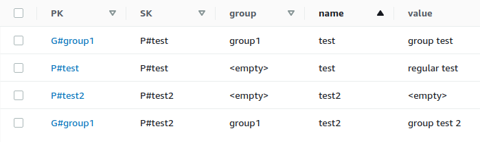

# config-service

`ConfigService.ts` is a class to manage configuration parameters and groups of configuration parameters with DynamoDB.

Parameters are set with the `P#` prefix on both keys, while parameters in a group have the `G#` prefix on the primary key. This allows querying by group and collecting all parameters in that group.

